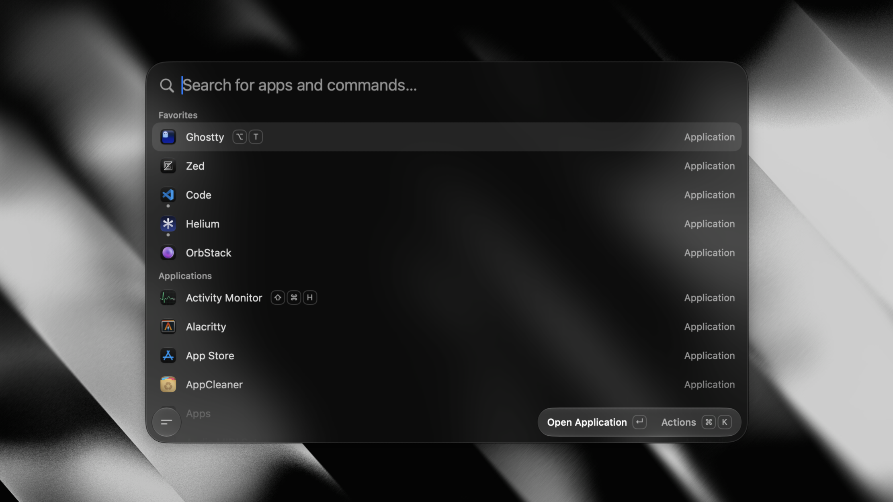

# Smallcast

A tiny, fully native macOS launcher — the essentials, without the bloat.

<!-- Screenshot placeholder — drop the real image at docs/screenshot.png -->
<p align="center">
  
</p>

Around **4 MB on disk** and **under 100 MB of RAM** — no Electron, no telemetry, no background
CPU churn. Just SwiftUI + AppKit with zero dependencies. It's fast because there's nothing to it.

It also **runs Raycast extensions** — the real ones, rendered as native SwiftUI. No Node.js, no browser:
JavaScriptCore ships with macOS, so that costs no extra binary size.

## Features

- **App launcher** — fuzzy-search and launch anything, pin favorites, see what's running.
- **Calculator** — do math and unit conversions inline, right in the palette.
- **Clipboard history** — text and images, searchable, pasted back into the app you were using.
- **Global hotkey** — one shortcut summons the palette from anywhere.
- **Per-app hotkeys** — bind a key to an app; press it to toggle (focus/hide).
- **Raycast extensions** — import the ones you already have and run them natively.

## Install

```sh
brew trust --tap arthur-fontaine/smallcast   # required for third-party taps
brew tap arthur-fontaine/smallcast
brew install --cask smallcast          # stable
brew install --cask smallcast@beta     # beta  (installs side-by-side)
```

Each channel is a separate app (`Smallcast.app`, `Smallcast Beta.app`) with its own settings and
permissions, so you can run stable next to the beta.

Smallcast is self-signed. Installing via Homebrew clears the macOS quarantine flag for you
automatically on every install and update, so there's nothing to run. (If you download the DMG
directly from Releases instead, clear it once: `xattr -dr com.apple.quarantine
"/Applications/Smallcast.app"`.)

## Permissions

**Accessibility** — needed only so Smallcast can paste a clipboard item back into the app you
came from. You're prompted the first time you paste; grant it in **System Settings → Privacy &
Security → Accessibility**.

## Using it

1. Open **Settings → General** and record a global shortcut to summon Smallcast.
2. Press it anywhere → the palette floats in. Type to filter, **↵** to launch.
3. **Tab** switches between Apps and Clipboard; **↑/↓** move, **Esc** dismisses.
4. **Settings → App Hotkeys** — search an app and record a shortcut to toggle it.
5. **Settings → Extensions** — import Raycast extensions, then run their commands from the palette.

### Raycast extensions

Smallcast runs the same prebuilt extension bundles Raycast does. **Settings → Extensions → Import from
Raycast** copies the ones already built on your machine; **Add Extension Folder…** takes any directory
you've run `ray build` in. Their commands then appear in the launcher under *Extensions*, and their
`List`, `Grid`, `Detail` and `Form` screens are drawn natively — same keyboard model, ⌘K action panel
included.

Most extensions work as-is. The notable exceptions are ones that sign in through Raycast's OAuth
redirect service, `menu-bar` commands, and Raycast's own cloud features (AI, window management).
See **[docs/extensions.md](docs/extensions.md)** for the full picture.

## Building from source

See **[docs/development.md](docs/development.md)** for the toolchain, build, packaging, release,
and website workflows, **[docs/ui.md](docs/ui.md)** for the UI design system, and
**[docs/extensions.md](docs/extensions.md)** for how the extension runtime works.

## License

[AGPL-3.0](LICENSE)
